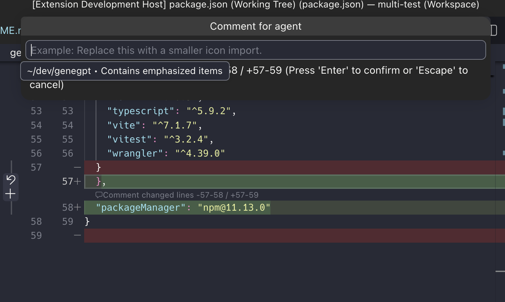

# vscode-diff-hunk-comments

Standalone VS Code extension that adds agent-ready comment actions to diff hunks.

This is intended to work with any normal VS Code text diff, including diffs opened by `vscode-git-tree-compare-ws`, because that extension opens files through VS Code's built-in `vscode.diff` command.



## What it does

- Detects the active VS Code text diff tab.
- Computes changed hunks from the original and modified documents.
- Adds a `$(comment) Comment for agent` CodeLens above each hunk on the modified side.
- Adds an editor-title/context-menu command for commenting on the hunk under the cursor.
- Prompts for optional feedback and copies a structured payload to the clipboard.
- Appends new comments to an existing Diff Hunk Comments clipboard batch, so you can collect several comments before pasting them into an agent.
- Optionally sends the payload to a configured VS Code command id.

## Limitations

VS Code does not expose an API to add real buttons beside the built-in diff gutter Stage/Revert controls. This extension uses CodeLens instead, which is the closest native, clickable per-hunk UI available from a separate extension.

If the inline CodeLens does not appear, verify that `diffEditor.codeLens` and `editor.codeLens` are enabled. This extension contributes those defaults, but an explicit user/workspace setting can still override them.

## Development

```sh
pnpm install
pnpm run compile
pnpm run package:vsix
```

Open this folder in VS Code, press `F5`, and open any diff. For `vscode-git-tree-compare-ws`, open a changed file from the Git Tree Compare view.

## Publishing

Before publishing, replace the `publisher` value in `package.json` with your Visual Studio Marketplace publisher ID and add a public `repository` URL if available. A repository URL is recommended so `vsce` can rewrite README image links for the Marketplace listing.

To publish locally:

```sh
pnpm run package:vsix
pnpm exec vsce login <publisher-id>
pnpm run publish:marketplace
```

To publish from GitHub Actions, add a repository secret named `VSCE_PAT` with an Azure DevOps Personal Access Token that has Marketplace Manage scope, then run the `Publish` workflow manually.

## Clipboard batches

The extension writes clipboard content with hidden `diff-hunk-comments` markers. If those markers are already on the clipboard, the next comment is appended to the existing batch instead of replacing it.

## Settings

- `diffHunkComments.promptForComment`: prompt for feedback before copying the payload.
- `diffHunkComments.agentCommand`: optional VS Code command id to receive the generated payload. If it is blank or fails, the payload is copied to the clipboard.
- `diffHunkComments.showOnAllDiffs`: when false, only shows CodeLens actions for diff titles containing `(Working Tree)`.
